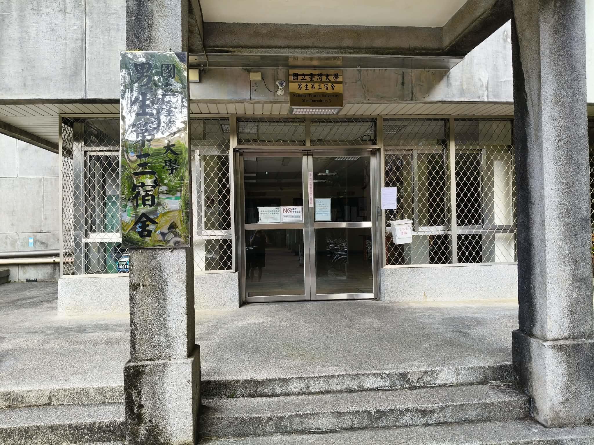
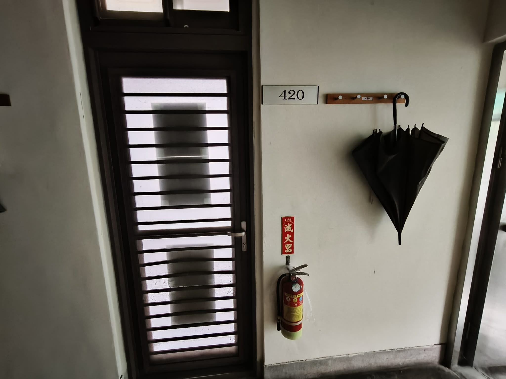
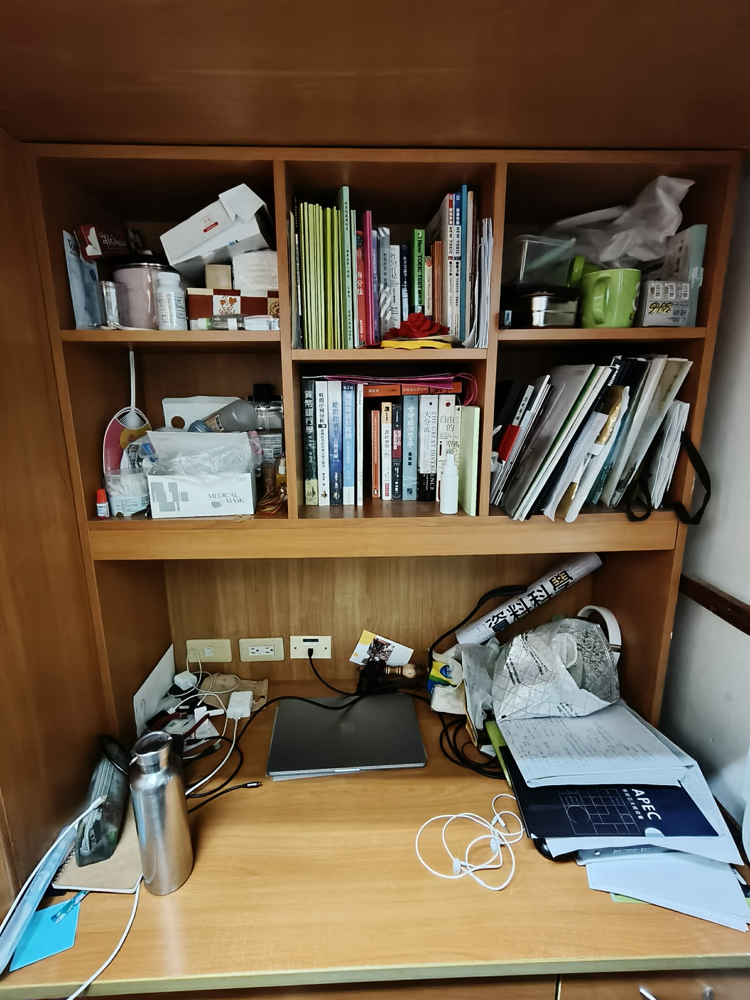
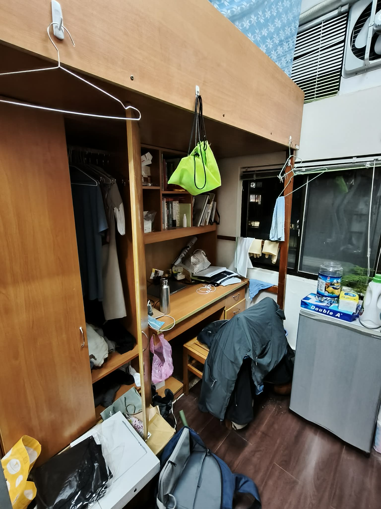
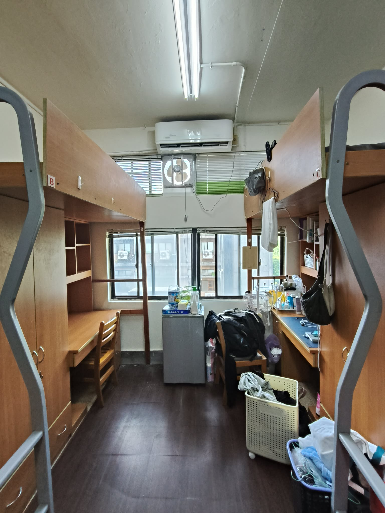
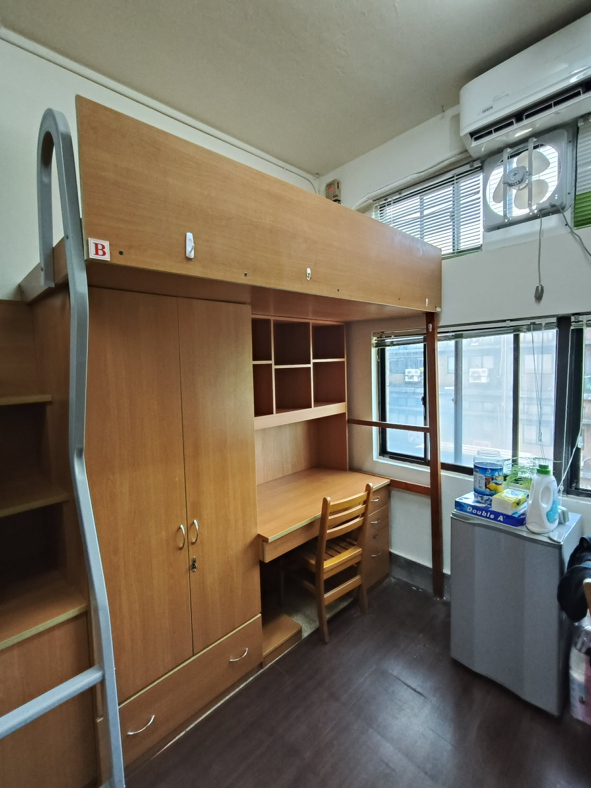
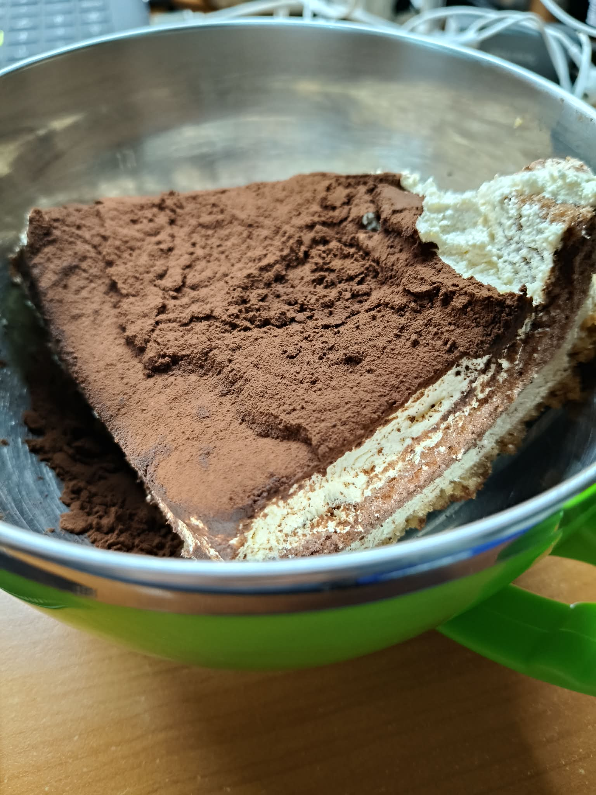

---
title: "告別男三"
description: "搬離住了四年的男三，記下五味雜陳的宿舍生活。"
date: "2026-09-03"
categories: ["大學"]
---

這幾天在搬宿舍，將十多盒紙箱從男三4樓搬到1樓，用推車運到對面的男六，再將所有東西從1樓搬到5樓。沒有電梯，只能徒手搬運。

原本已經跟朋友講好住他的空房，但要搬家的前兩天，就候補到男六的床位了，一番天人交戰後還是選擇住學校宿舍，因為我想不到有什麼理由不住宿舍。如一句經典電影台詞所說，「這些牆^[原本指監獄，在這裡我把它比喻為宿舍。]很有趣。剛開始你恨它，然後你習慣它，時間久了，你離不開它（引自《刺激1995》，雖然描述的情境不太相同，但我總覺得住在宿舍到最後，就會出現這種感覺）。

---

還沒好好告別男三，想先從住了四年的地方開始講起。

國立台灣大學男三宿舍，台北市大安區最便宜的租屋處之一。一學期四個月，原價應該是9000多，扣除政府無條件補助5000後，相當於一個月的租金為1000多。

男三的第一個優勢便是「大」，四人一屋，雜物隨意擺放地上，中間還是有空間可以自由通行^[看來，我在男三的陋習無法原封不動地搬進男六。]。第二個優勢則是地理位置。走出男三大門，可以直通全家與早餐吧（即便中間那段遮雨棚逼近沒用），宵夜與早餐近在咫尺。坐落於長興街區的男三，進去學校只需要跨過基隆路這道鴻溝，最多等百秒的紅綠，如果住外面要來到學校，即便是腳踏車到得了的距離，可能也要跨越2~3個路口。

過了基隆路，到鄭江樓只需要半分鐘的車程、社科院只需要1分鐘、總圖只需要1分鐘、天數館只需要3分鐘，基本上這是我大學最常去的幾個地方，男三作為中繼站，占盡地利之便^[還有，去財資可以搭公車直達。]。

然而，最便宜的租屋處不是沒有代價的。以下細數各種令我困惱的經驗：

- 夏日燠熱難耐，冬天如入冰窖。
- 每逢黃梅時節，大水螞蟻成群自窗口登陸，我總被迫拋下手上的工作，開始與室友進行大規模撲殺，就像是古代人必須面對週而復始的蟲害。
- 整個樓層只有兩間坐式馬桶，每次去永遠都有人^[這兩間是最髒的，後來都用蹲的了。]；其餘的蹲式馬桶，總有前人用不完的衛生紙（那你抽那麼多張是要幹嘛？）。
- 浴室每晚總會有人想要展現他的歌唱天賦，即便走音仍舊要放聲高歌。
- 曬衣場永遠都是滿的；洗手台永遠都有一堆食物殘渣。
- 每次開門都會固定看到的NPC；總是有人要跟我搶固定的刷牙位置。

這些瑣事不免擾人，但無法與男三的好相與抗衡；環境是其次，重點是跟誰住在一起。我很幸運，大學室友平均水準為中上。

我在大二的時候跟高中同學（A,B,C）四人綁抽，順利留在校總區，而非發配邊疆（城中校區）。既是高中同學，協商成本相對低，即便有些生活習慣的不同，也是落在容忍誤差內^[如果你看得到，我就不是在講你XD。]。

印象中，A會忙到10點回到宿舍，先趴在桌上看手機一陣子，然後洗澡後繼續工作，總是最早就寢（幾乎都是他先熄掉大燈）；B下課回宿舍後，開始坐在書桌前或是躺到床上滑手機，滑到一定時間後去健身或是洗澡，回來後繼續耍廢，考前才會奮發圖強；C跟我是差不多的狀態，他認真地研讀法律文獻，我勤奮地在解一階條件。多數時候，四個人各忙各的，偶爾小聊以消磨時日。

等到大四，A出國交換，補進了新室友W；等到大五，兩位法律系的畢業了，進來了兩個戲劇系的學弟。W簡直是室友楷模，完全不會踩到別人的雷（話說回來，我應該擔心自己是否有踩到他的雷），他是我大五少數的伴，偶爾一起吃飯與打球；另外兩位室友在生活上也沒有太多讓人反感的地方，那些過往覺得吵雜的聲音，似乎逐漸變得不再刺耳。

8月上旬，我成為高中室友四人組最後一位離開420的人，男三正式成為時代的眼淚。這個地方有太多荒謬到難以形容的糟，對我而言卻是瑕不掩瑜：可以去頂樓走動與曬太陽、晚上跟室友一起下樓買宵夜、考前早起的周末要負責叫醒室友B、八次的期中期末夜點必拿提拉米蘇……雖然碩班還住宿舍，這些生活碎片或許已成為難以復刻的回憶，只有在往後與他們相聚時，才能重新攏成一撮老舊茶葉，在閒聊之際沖上幾回。

:::: {.dorm-gallery layout-ncol=3}

::: {.dorm-landscape-stack}
{.lightbox group="college-dorm" fig-alt="男三宿舍大門"}

{.lightbox group="college-dorm" fig-alt="420 寢室門口"}
:::

{.lightbox group="college-dorm" fig-alt="整理前的書桌"}

{.lightbox group="college-dorm" fig-alt="整理前的床位"}

{.lightbox group="college-dorm" fig-alt="宿舍全景"}

{.lightbox group="college-dorm" fig-alt="整理後的床位"}

{.lightbox group="college-dorm" fig-alt="期中期末夜點的提拉米蘇"}

::::

::: {.callout-note appearance="simple" icon=false}

住了男六兩三天，整體給人的感覺還不錯，空間也不會太擁擠。一如既往，到學校或財資都相當方便，爬5層樓對我來說也不是問題。目前只有見到一位香港室友，希望剩下兩位都是可以很好相處的。

:::
