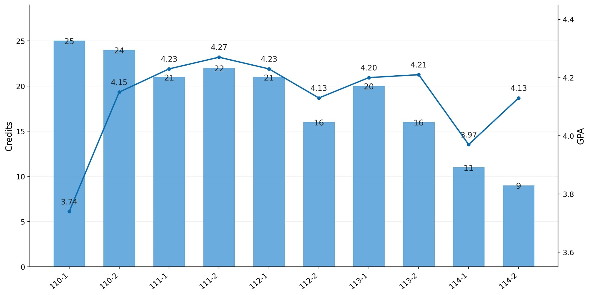
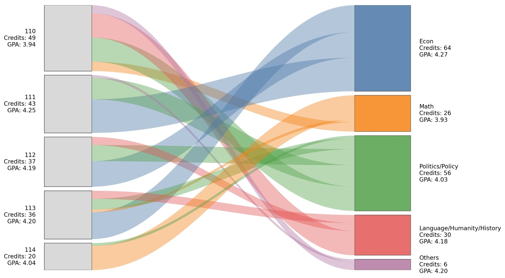

> 這篇流水帳，大部分內容是大四結束的那個暑假所寫，近期拿出來翻修完筆。內容的格局比較大，主要記錄大學某些時間點的所思所想。

2026年5月30日，臺灣大學畢業典禮。
距離上次參加這種轉換身份的重大活動是在八年前（國三）。
高三那年，疫情打亂現實的一切，任何實體活動取消或延期。在高中的最後一堂課（我記得是宸瑩的公民課），一邊聽著老師在線上祝福我們畢業快樂，一邊在空無一人的323訂正著指考模擬考題本。當時根本不曉得未來將落腳何處，一點畢業的感覺都沒有。

高中的我，沒有時間與能力（但不是沒有資源）尋找有興趣的領域，卻期待著考進世俗眼光中的好學校、好科系。弔詭的是，我從來沒有去認識該科系真實的樣態^[比如當時想讀管院，特別是財金系，沒有任何具體的理由。]。原本想像自己能成為自由選擇科系的高分群，然而命運之神打破了我眼高手低的幻想，淪落為由科系來決定我的命運。

當然，旁人不會這麼認為。如果把人生幾場重大考試想成一系列的 RD design，我算是幸運的一方，總是落在斷點的右側。只是成績單上的數字，可能不夠好看、不夠漂亮。

---

學測、指考兩度失常後，我跟家人與幾位好友討論了很久，決定填政治系公行組^[我看了當時填寫的志願單，前五志願分別是：臺大工管、臺大經濟、臺大政治國關、臺大政治公行、臺大政治政論。]，可能家人覺得走入公務體系是個不錯的選項，不過後來想想，讀政治系也不是成為公務員的充分條件。

大一修政治系必修課時，總覺得自己無法運用政治理論的思維理解社會，或許是個人能力問題，或許是老師的教學風格、教學方式，以及學科的屬性使然，我始終無法掌握這個體系的脈絡。另一方面，公行組很多考試，似乎都在測驗誰比較會背誦[^1]。即便我是一個很會背書的人[^2]，也不喜歡把不感興趣的事物強硬塞入腦中，而且多數時候考試一結束就會忘得一乾二淨。這種無法增值的學習模式，我不太明白意義何在，但這似乎是準備公職考試的常態。

[^1]: 也許不能以偏概全。以某些申論題來說，若平常沒有廣泛涉獵與閱讀，在考場上將流於主觀形式的偏頗論述，而沒有一致的標準與邏輯存在。
[^2]: 白話文可以解讀為死讀書。

即便心中有著微弱的異音，整體還是朝著公職的方向努力。為了拓展一般行政外的專業領域，我開始在公職網查詢各種招考類別，比如法律、會計、經濟等。其中，經濟領域除了基礎的經濟學外，還包含了財政學與貨幣銀行學等，聽起來是相當有趣的科目，但只有真正修過才知道喜不喜歡。

雖然高中待在實質意義上的人社班，我對經濟學這門學問並不熟悉，頂多停留在考試會畫供給與需求曲線、計算社會福利。高三後半段選修公民出現了一些支離破碎的總體詞彙（通膨、通縮），我似乎沒有真正搞懂過。但在大一那個尋找考科的寒假，我開始思考能否藉此機會把當初不太懂，或迫於大考壓力沒有弄懂的東西補起來，我想經濟學某個程度就像數學一樣，並不是我非常擅長的東西，卻又有想把他弄懂的衝勁。

---

我在大一下向啟超學長借了吳聰敏老師所寫的經濟學原理課本，配著吳老師的影片開始自己讀，逐漸熟悉基礎經濟學的思路，也滿確定大二想修經濟學的課程；在大二上修完經濟學後，就更篤定自己想轉到經濟系。我認為主要有兩大原因：

1. 對我來說，經濟學邏輯縝密，使我更能掌握分析的框架與脈絡，只要中間某個環節卡住，我可以停下來思考為什麼，並給出一個自己滿意的解釋。經濟學集文字、圖形與數學於一身，既是一門藝術也是一門科學，我們學習將複雜的大問題化約成一個個小問題，逐步觀察這些小問題的細節與紋理，試圖拼湊出經濟社會運作的樣貌。

2. 在政治系的課堂多少會接觸到一些公共議題，我對於政策分析滿有興趣的（相對地，我對政治議題沒興趣）。但臺大政治系是一個質化取徑為主的科系，跟我的偏好不太一樣。懷著想精進量化方法的動機，期待著以量化的角度研究公共議題，我決定在大三那年轉系（時間軸算是慢了同屆一年）。

由於政治系的課已經修了一半，感覺放棄一個學位太可惜，我選擇雙主修回政治系^[系統志願序的判定是：轉系 $\rightarrow$ 雙主修 $\rightarrow$ 輔系。幸運的話，可以同時轉到自己的理想科系，並雙主修回自己原本的科系。]。

---

然而，這一路上都在猶疑不定間雙主修，大學前四年修了165學分，大約有6-7成沒帶走任何東西，只剩下3-4成有「學東西」的感覺。我在一、二年級的時候會在一學期修20-25學分，這種以數量換取質量的修課策略，導致很多基礎都沒打好，學習節奏也相對錯亂無序，畢竟要好好學習一門課，所花的時間遠超過所對應的學分數，但在各種考量下，我被迫只能採取這種選課策略。

或許在這種學習模式下，我會預設立場哪些課對我是重要的、哪些課比較吸引我，我才會投入大量的時間學習，其他的課很可能就是蜻蜓點水般帶過。另外，每到學期後半段經常會產生學習上的倦怠感，無法明確告訴自己這堂帶給我的意義。這種念頭尤其在大四的時候特別明顯，每次期中期末各科作業、考試排山倒海而來，心中不乏停修的念頭，但最後還是咬著牙撐到最後^[不過話說回來，前四年這麼累也有好處：讓我在大五時可以專心被線代導與分導轟炸。]。

另一方面，在學習知識的過程，我算是一個很喜歡發問的人。小時候無所顧忌，但長大以後，我開始懷疑某些問題值不值得被問。也許，有些問題應該嘗試自己解決、有些則是需要求助他人，但我很常抓不到這層界線在哪。比如一份困難的作業，我可能想了一個晚上或周末卻還是無法解決，就會開始求助別人^[很顯然這時期的我，還沒碰過分導這種鬼東西。]。當朋友提供我解題的思路，豁然開朗的當下，背後似乎藏著更多的警訊：

1.	為何自己當下沒辦法想到這個解法？
2.	當同學都想得到了，自己卻沒想到？

這層能力上的差距，讓我懷疑自己其實不懂經濟學，或者不適合念經濟學，因為自己沒辦法像他人一樣游刃有餘地解決問題。但古慧雯老師告訴我，即使看到那麼多數學比她好的人，她也不會因此不念數學；同樣地，不可能因為看到前面有人比自己厲害，就不念經濟學、不念數學，更何況我身後還有一群人，如果都覺得自己不行了，不就等同否定後面的那群人了嗎？

古媽提醒我，應該回歸一項核心問題：Do I love economics from the bottom of the heart? 
我此刻的喜歡，是建立在兩相比較下的感受（政治系vs經濟系），但是否在學習的當下，油然而生愉悅的感受、會因為突然理解以前覺得困惑卻無法回答的問題而感到興奮（就像在修線性代數導論一樣）？

仔細回想，這種感受可能有出現，但沒有到非常具體與明確，至少在建構理論的過程是如此。
不過，在接觸有興趣的領域時（勞動、貨幣與總體等），經濟學那股神奇的魔力再度流入我的思緒，我總想著如何運用這套分析架構來回答問題。為此，我開始擔任研究助理，開啟經濟學研究的旅程。

---

雖然起步較晚，至少在大四時幸運進入C2L2，跟著冠銘老師一起做研究。
在實驗室的第一年，成天與骯髒的原始資料為伍，花了許多的時間與精力清理財稅、勞保、選舉、民調資料等。這本質上不是一件非常困難的任務，但過程卻繁瑣的令人討厭。由於清理財稅與勞保資料是在斷網的情況下進行，即便事先在外頭進行了幾次沙盤推演，一進到資料中心還是經常發生一堆問題，比如變數定義方式跟想像中的存在落差，需要透過一些間接的方式修正與檢查，或者資料中出現一些奇怪的個體，在龐大的資料海中，必須停下來仔細觀察這些個體的數值為何不合常理、為何某些年度的數值會相互矛盾。這種臨場發生問題，卻沒有agent在一旁協助分析的情況下，我都是不太有把握地去猜測可能的解法，再想辦法轉換成程式碼。因為不是程式高手，經常需要跑到門外諮詢GPT。

在財資中心或勞研所的一天，一開始總能氣定神閒地分析遇到的突發問題；一旦跑完一輪發現還是不對勁的時候，時間通常就所剩無幾，這時的我便是匆匆忙忙、連滾帶爬。離開資料中心的路上，心頭還懸著剛才在最後一刻尚未解決的問題，一想到必須等到下次進去才有辦法處理，實在是非常難受。

熬過漫長的清資料過程，在實驗室第二年，我嘗試用資料「驗證」我們想像中的故事。
分析資料，其實是比前一步驟更困難的挑戰，因為線性迴歸每個人都會跑，但跑出來的結果是不是有意義，是不是真的識別了某種因果關係，其實有時候我還滿心虛的。或許，老師想像的故事並不是要拿來驗證的假說，反而像是必須達成的結果。為了看到這個結果，你會想辦法調整迴歸的跑法，把資料捏成我們想說的故事。我曾經跟啟超學長聊過，他說自己小時候也不太能認同這種研究方式，不過，當這種手法儼然成為這個領域所認可的遊戲規則，只要大家買單，好像也不是不可以。或許比起糾結這個定型的（可能還稍微扭曲的？）生態，重點是讓自己在過程中因為發現了些什麼而感到開心，這才是最重要的。

此外，我覺得現階段的自己比較像是學徒，KMC則是師傅，師傅請你做甚麼，你就負責做甚麼，並沒有太多開創性、獨立性的研究空間。就目前擔任研究助理的經驗而言，大部分的工作內容是在寫程式，不過在AI的協助下，這已經是任何人都能輕易上手並學習的技能。相對地，在問問題、讀文獻、學習理論與方法這幾個研究的核心訓練，我感覺在實驗室並沒有特別被強調[^3]，不確定是因為我目前的研究題目使然、還是我不夠有效率與能力去獨自學習這些事情。在大五修數學課之前，因為很有時間可以懷疑人生，所以常常問自己是不是做學術的料，也不確定自己的能力可以推進到哪個層次。徬徨不定時，常會找啟超、挺智或冠銘老師聊聊[^4]。不過我想，如果自己能擁抱此刻的狀態，會因為想了解一些問題，並懷著試圖解答的好奇，我想這個地方就值得繼續待下去。如冠銘所說，發表一篇好的研究如同磨一把利劍，一磨就是十年。

[^3]: 也可能是我慧根不夠，沒有發現在做研究的過程已經有這方面的訓練。

[^4]: 這陣子比較少，畢竟大五在深山修行。

也很幸運能在實驗室認識了一些厲害的學長姊與朋友^[不過想想也少的可憐，可能只有645與至磊？]，讓我這條路上充滿不確定性的道路能走得安穩一些。至於接下來的旅程會如何展開，等9月開學就知曉了。

---

大五沒什麼新鮮事，主要的故事都寫在[數學之旅](math_journey.qmd)。

---

最後以一些冰冷的數據為大學做總結。左圖記錄了大學每一學期的學分數與 GPA，右圖整理了不同年級修課領域的分布。

::: {#fig-academic-summary layout-ncol=2}
{#fig-gpa-credits .lightbox group="gpa-credits"}

{#fig-academic-sankey .lightbox group="academic-sankey"}

大學期間的 GPA、學分數與修課路徑
:::

左圖的走勢大致是，大一上糊里糊塗的開局、大一下校正回歸；大二為了轉系全力衝刺成績，大概也是大學讀書生涯的巔峰時刻^[同一年(2022年)我支持的勇士隊也成功奪冠，可見我與勇士精神同在。]。轉系之後，似乎就抓住在大學獲得不錯成績的方法，至少都能維持在一定的水準之上。不過，這並不代表我真的學會了很多東西，很可能只是在應付考試、拿到成績這方面很有一套罷了。

另外，學分越少並不見得可以把GPA衝高。因為在學分數很多的學期，大部分的課都可以「一分耕耘，一分收獲」地拿A+；但在學分數少的學期，需要面對魔王等級的課，除了努力外，能否獲得老天的眷顧也至關重要（e.g.分析導論）。

右圖主要想傳達的故事是，雙主修沒有太多的選擇自由。
基本上前四年的課程地圖都被限縮在公行組與經濟系的範疇，頂多在大一、大二時，還能選修一些有興趣的通識課來調養身心或消磨度日。作為語資班畢業的學生，出於好奇，我也特別把文史領域的課程標示出來，發現還占了不少比重，主要就是國文、英文寫作與表達、歷史系選修與法文^[如果有時間，我真的好想修法文。]。最後，數學系的課雖然修的不多，但一堂課的學分數最多可以抵政治系的3門、經濟系的2門。如果想知道更多修課的心得，歡迎閱覽[大學修課反思](course_review.qmd)。
