有別於[大學回顧（一）](college_reflection_part1.qmd)拖泥帶水的敘事，此文將精簡呈現大學剪影。

心中一直有著寫出這篇的計劃，無奈自己太貪玩了，回台中後擱置了半個多月，趁開學前加緊完工。

---

## 做學問

平心而論，我的高中生活似乎比大學生活還要精彩（從[吉他社與科志](high_school_extracurricular_activities.qmd)、[語資](loc.qmd)可見一斑）；大學生涯，倒是活成了許多高中生的樣子。看似平凡的五年，我不覺得自己有蹉跎任何光陰（也可能只是成為了井底之蛙卻不自知），緩步朝著遙不可及的目標前進。至於是什麼目標，我很難用三言兩語精準描述，更遑論畫出一幅清晰的藍圖，因為猶疑不定的心，總隨著畫筆不斷塗改。但這是好事，因為我脫離了高中時期一些病態的糾結（[跨不去的坎](high_school_study.qmd)），而是想著人生的下一哩路要怎麼走。

我在大學時期沒什麼建樹，充其量就是完成了雙主修的學位。當年先以政治系的身份入學，誤打誤撞進入經濟學的殿堂，在學習的路上，我嘗試用這套分析框架理解這個世界。有時候會覺得理所當然，有時候腦筋又會轉不過來，常常會擔心差人一截，自己是不是不適合念經濟學。我很感謝教導我個經與賽局的古慧雯老師，她告訴我能不能念不是跟別人比較，而是自己是否真心喜歡。

我很感謝冠銘老師，讓我在大學就有機會做研究，即便有時難免會覺得，研究題目與跑出來的結果，如狗肉進不了大上海。不過我想，這段過程仍是成長路上難能可貴的養分，我想繼續在這個地方，探索他人仍未發掘的瑰寶。

我特別感謝數學系的國榮老師，在大四下才遇見他實在是相見恨晚。他重建了我學習數學的能力與信心，讓我在短短一年半的時間內，對於理解世界的運作與分析事情的角度，變得更加不同（[數學之旅](math_journey.qmd)）。

每當在學習或研究上感到徬徨時，很感謝啟超與挺智學長願意聽我說話，並給我一些方向與鼓勵。
啟超為我開展經濟學這幅宏闊的知識輿圖、挺智則啟蒙了我許多計量與因果推論的概念^[當然還有KM。]。他們的建議從不是改善知識能力的不足（即便這是我最常自我懷疑的方面），而是告訴我常保對學習的熱忱，享受學習的過程；能在做學問或研究的過程，因為發現了些什麼而感到開心，這才是最重要的。在我剛認識挺智時，他曾經回覆我一篇長信，信中説道：

> …… 人難免會想與他人比較，但要告訴自己無需如此，就像那句有點雞湯的話，「每個人都有自己的時區」。每個人有各種各樣不同的天賦與成長經驗，考試可以很輕易地爲同學們當下的學習表現分出高下，但對於付出的努力、對於學習的態度這些更重要的方面，大概無從置喙。而我認為後者是更重要的。
> 

此外，645的學長姐與王老師也給了我很多的幫助，我這朵溫室裡的蓓蕾才能被照護地這麼好。

## 舊雨新知

字數與排序不代表重要性，圖片也可能有所缺漏，但我猜已經列完9成了，因為我實在沒什麼朋友XD

- 我的室友兼好友定一，大學時帶我去吃好多好吃的東西，也一起鬼混了不少地方。即便高中沒什麼連結，大學竟意外成為莫逆，他畢業後，我大五幾乎每個週末都會前往好食，永遠都點同樣的經典組合（起司蛋餅、菲力丹麥吐司與鮮奶茶），我猜，這個地方大概很難再找到第二個人跟我這樣一起吃了，在這個空間的雙人組合，是難以替代的。
- 我的學號是B10，但在修經濟系的課時，多數時候都是跟B11的一起修，如果不要臉的把自己的屆數向下平移，至磊（還有王老師）可能是我少數認識的同屆（？）他即將航向未知的遠方，祝福他能找到心中劃定的座標。
- CLT：與C在實驗室認識，與T在中研院三周的營隊認識，雖然每個人的方向不同，希望未來仍有機會重逢。
- 修課好夥伴：轉到經濟系後認識的學長，跟他一起修了好多課，個經、賽局、貨銀、分導、線代導等，未來依舊是經研所的修課好夥伴。
- 國中死黨：聚少離多，寒暑假回家一定會約打球、玩switch、出遊等，只爭朝夕。
- 其他：見附圖

:::: {.reflection-photo-wall}
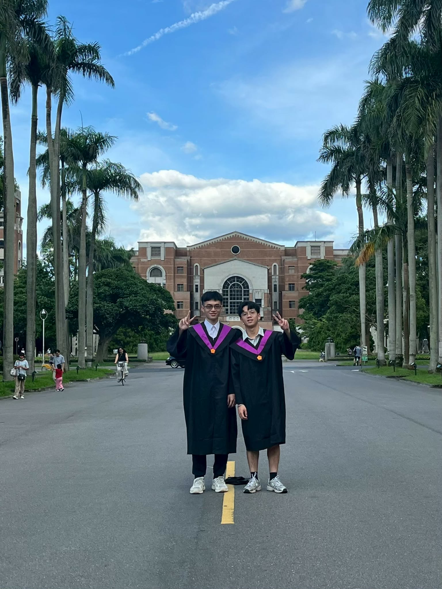{.lightbox group="college-reflection-part2" fig-alt="與定一合影"}

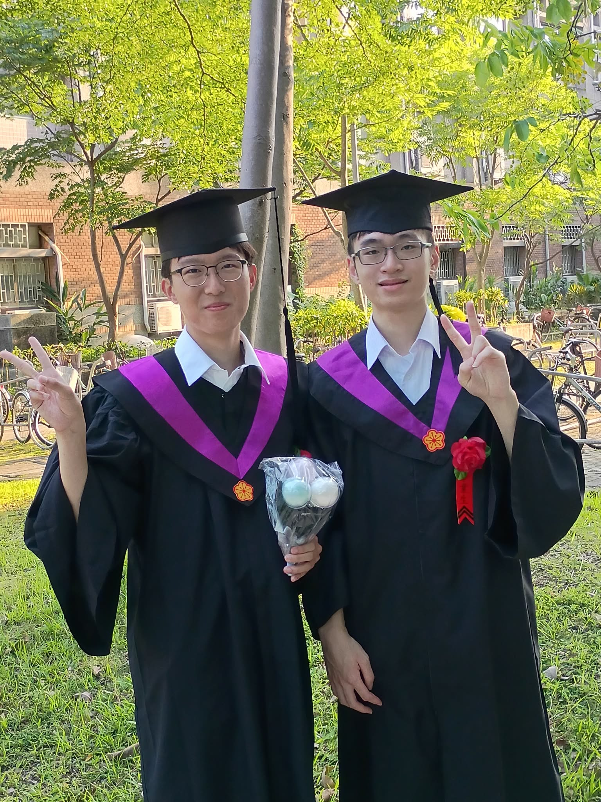{.lightbox group="college-reflection-part2" fig-alt="與至磊合影"}

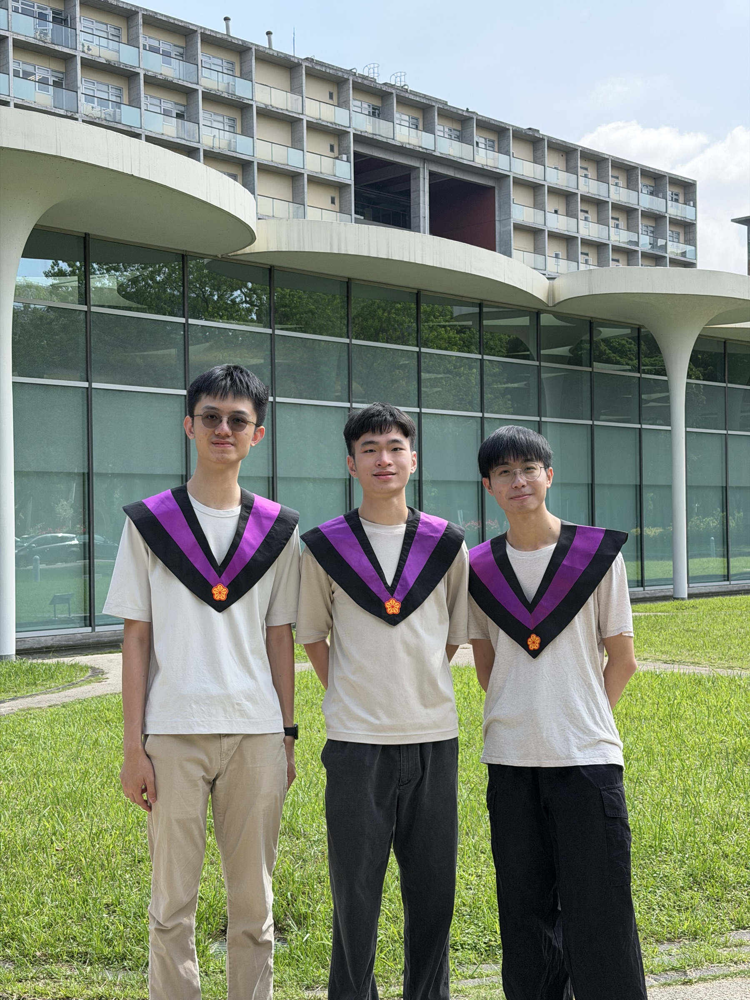{.lightbox group="college-reflection-part2" fig-alt="CLT畢業合影"}

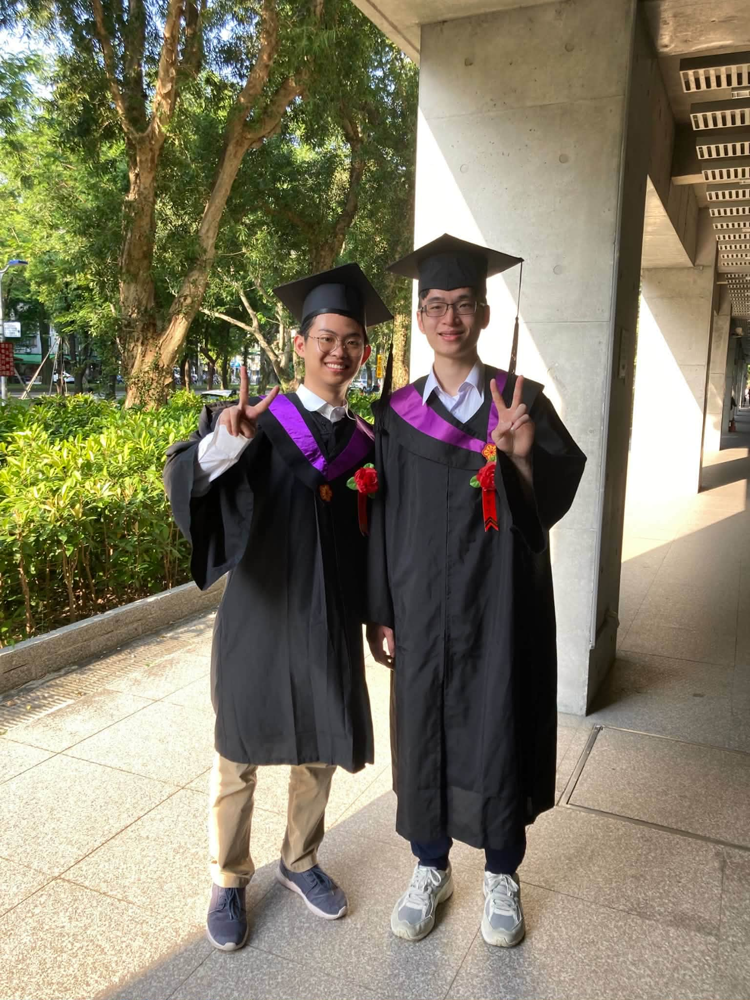{.lightbox group="college-reflection-part2" fig-alt="與修課好夥伴合影"}

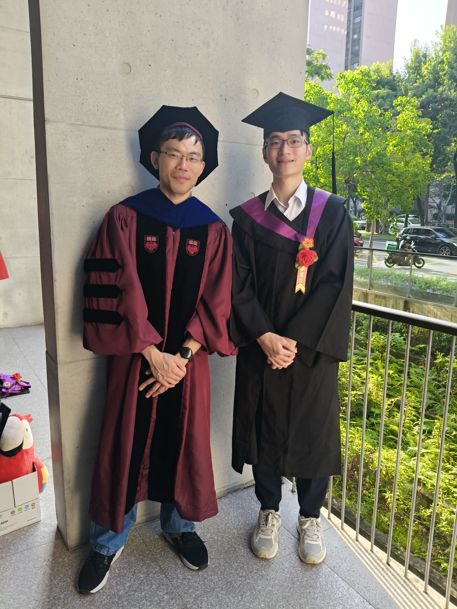{.lightbox group="college-reflection-part2" fig-alt="與冠銘合影"}

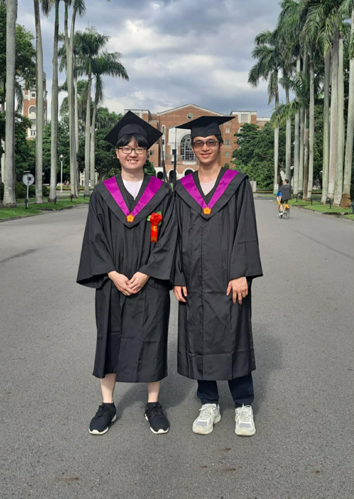{.lightbox group="college-reflection-part2" fig-alt="與Thomas合影"}

::: {.reflection-photo-stack}
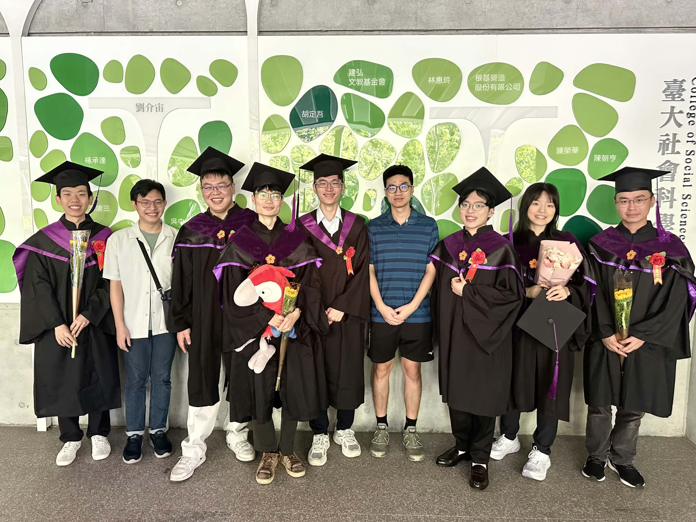{.lightbox group="college-reflection-part2" fig-alt="645與王老師"}

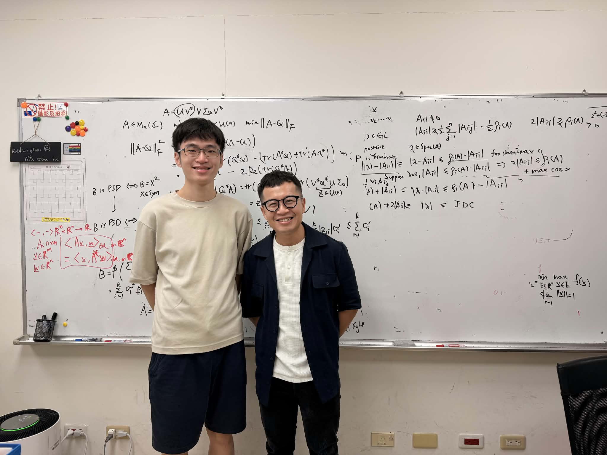{.lightbox group="college-reflection-part2" fig-alt="與國榮合影"}
:::

::: {.reflection-photo-stack}
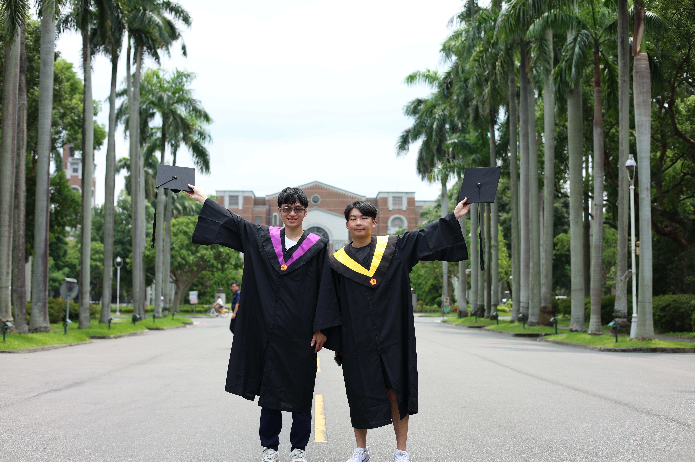{.lightbox group="college-reflection-part2" fig-alt="與室友楷模合影"}

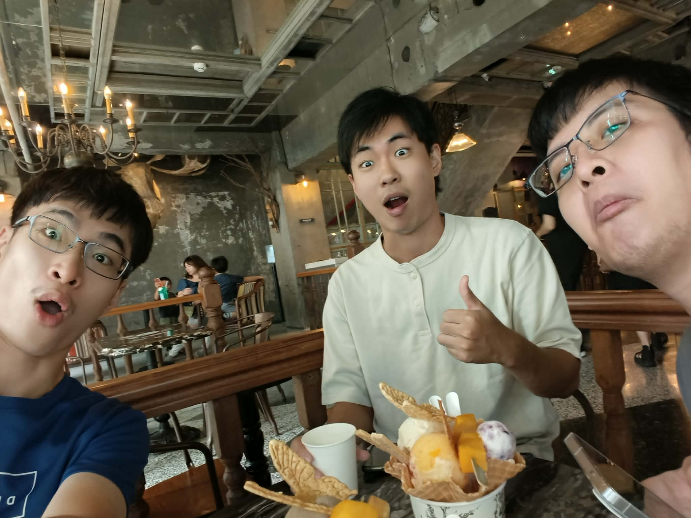{.lightbox group="college-reflection-part2" fig-alt="高中死黨"}
:::

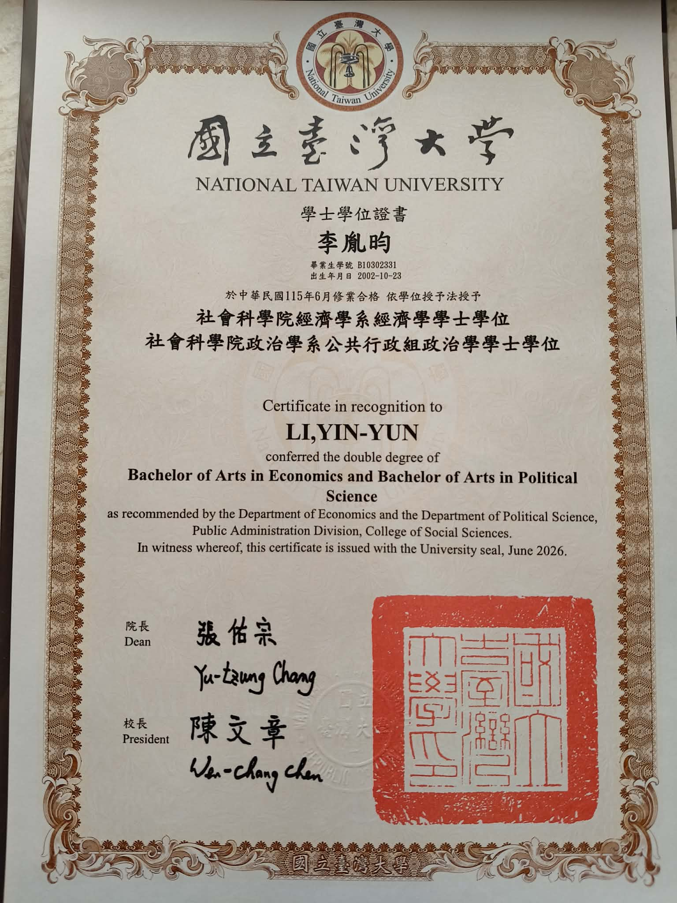{.lightbox group="college-reflection-part2" fig-alt="畢業證書"}
::::

## 後盾

最後則是感謝家人一直以來物質與精神上的支持，即便他們不知道我在大學實際上做了些什麼（可能只知道我在讀書而已），卻給了我很大的自由度，能在自己想像的路途前行。

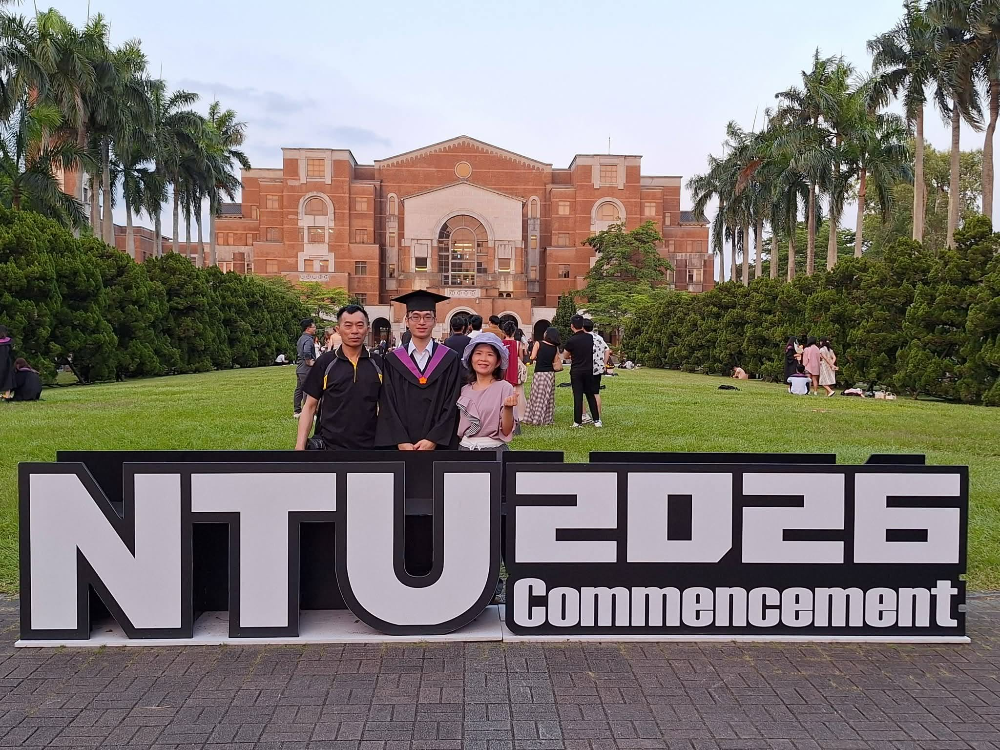{.lightbox group="college-reflection-part2" fig-alt="與父母合照"}

當年成為家中 First-gen 的大學生，外公外婆的喜悅溢於言表。只不過他們一直沒有機會上來看看這所校園，而我也不再有機會見到他們^[外公在大一剛開學不久後就離世、外婆則是與各類慢性病纏鬥，兩年前也與世長辭。]。學習從不是為了別人，不過我想如果今日在大學稍有小成，一切都要歸功於他們，如果兒時沒有他們的疼愛與照顧，也不會有今日的李胤昀。每當自己對學習感到厭煩，或萌生放棄的念頭時，一想起他們，心中又重新燃起了鬥志，因為我不能辜負他們的期望。大學這份文憑，在很久以前我就發願，要獻給天上的他們，而我也相信此刻的他們，會以我為傲。

---

面對景物依舊，人事已非^[這樣形容確實有些誇張，但看到熟悉的人逐漸離開校園，不免感到失落。]的校園，碩班生活也即將展開。期望自己能無畏險阻，享受「學習」本身帶來的快樂，
並持續進步，同時也不忘提醒自己，慢一點，沒什麼關係。
